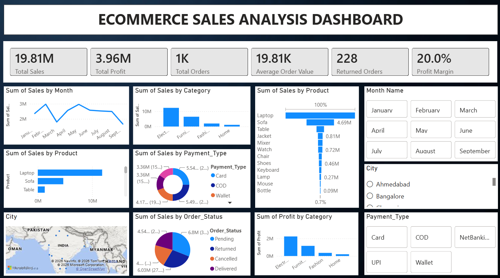

# ecommerce-sales-analysis
End-to-End Data Analytics Project using Python, MySQL, and Power BI to analyze e-commerce sales, customer behavior, profitability, and business performance.


---


## 📌 Dashboard Preview



---

## 📖 Project Overview

This project simulates a real-world business scenario where an e-commerce company needs to monitor sales performance, identify profitable products, analyze customer purchasing patterns, and make data-driven business decisions.

The project follows a complete analytics workflow—from raw data exploration in **Python**, business analysis in **MySQL**, and interactive reporting in **Power BI**.

---

## 🎯 Business Problem

Management wants to answer questions such as:

- Which products generate the highest revenue?
- Which categories are most profitable?
- Which cities contribute the highest sales?
- Which payment methods are preferred?
- Which months perform best?
- How many orders are returned?
- What is the overall profit margin?

---

## 🛠 Tech Stack

| Tool | Purpose |
|------|---------|
| Python | Data exploration |
| Pandas | Data cleaning |
| NumPy | Numerical analysis |
| MySQL | Business queries |
| Power BI | Dashboard creation |
| DAX | KPI calculations |
| GitHub | Portfolio hosting |

---
## 📂 Dataset

The dataset contains **1,000+ e-commerce orders** with information including:

- Order ID
- Product
- Category
- City
- Payment Type
- Order Status
- Quantity
- Sales
- Profit
- Discount
- Order Date

---

## 🔄 Project Workflow

Raw Dataset
    ↓
Python (Cleaning & EDA)
    ↓
MySQL (25 Business Queries)
    ↓
Power BI (Dashboard & DAX)
    ↓
Business Insights & Recommendations

---


## 🐍 Python Analysis

Python was used for initial data exploration and validation.

### Tasks Performed

- Imported dataset using Pandas
- Explored data structure
- Checked data types
- Identified missing values
- Checked duplicate records
- Created month-based features
- Prepared data for SQL and Power BI


### Sample Code

```python
import pandas as pd
import numpy as np

df = pd.read_excel("Dataset.xlsx")

df.head()
df.info()
```

---

## 🗄 SQL Analysis

A total of **25 business-focused SQL queries** were written to answer real business questions.

### Sales Analysis

- Total Orders
- Total Sales
- Total Profit
- Average Order Value
- Profit Margin

### Product Analysis

- Top Products
- Bottom Products
- Product Profit
- Quantity Sold
- Average Discount

### Category Analysis

- Sales by Category
- Profit by Category

### Customer & City Analysis

- Top Cities
- Bottom Cities
- Orders by City

### Time Analysis

- Monthly Sales
- Monthly Profit
- Monthly Orders

### Payment Analysis

- Sales by Payment Type
- Orders by Payment Type

### Order Status Analysis

- Orders by Status
- Return Rate
- Profit Lost in Returned Orders

### Example SQL Query

```sql
SELECT Product,
       SUM(Net_Amount) AS Sales
FROM orders
GROUP BY Product
ORDER BY Sales DESC;
```

---

## 📊 Power BI Dashboard

The interactive dashboard enables business users to explore sales performance through filters and KPIs.

### Dashboard Features

- Executive KPI Cards
- Monthly Sales Trend
- Category Performance
- Product Performance
- Profit Analysis
- Payment Distribution
- Order Status Breakdown
- City-wise Sales Map
- Interactive Filters

---

## 📈 Key Performance Indicators

| KPI | Value |
|-----|--------|
| Total Sales | ₹19.81M |
| Total Profit | ₹3.96M |
| Total Orders | 1K |
| Average Order Value | ₹19.81K |
| Returned Orders | 228 |
| Profit Margin | 20% |

---

## 📐 DAX Measures

Key measures created during dashboard development.

### Total Sales

```DAX
Total Sales =
SUM('ecommerce orders'[Sales])
```

### Total Profit

```DAX
Total Profit =
SUM('ecommerce orders'[Profit])
```

### Average Order Value

```DAX
Average Order Value =
DIVIDE([Total Sales],[Total Orders],0)
```

### Profit Margin

```DAX
Profit Margin =
DIVIDE([Total Profit],[Total Sales],0)
```

---

## 💡 Key Business Insights

The analysis revealed several important findings.

- Electronics generated the highest sales revenue.
- High-performing products contributed a significant portion of total revenue.
- The business maintained an overall **20% profit margin**.
- Returned orders indicate opportunities to reduce losses.
- Payment behavior is distributed across Card, UPI, COD, Wallet, and Net Banking.
- Sales fluctuate across months, suggesting seasonal demand patterns.

---

## 🚀 Business Recommendations

Based on the analysis, the following actions are recommended.

- Increase marketing investment in high-performing categories.
- Investigate reasons behind returned orders.
- Improve inventory planning before peak sales months.
- Promote digital payment methods through customer incentives.
- Focus regional marketing on top-performing cities.

---

## 📁 Repository Structure

```text
ecommerce-sales-analysis/
│
├── Dashboard.pbix
├── Dashboard.png
├── Dataset.xlsx
├── Python_Analysis.ipynb
├── SQL_Queries.sql
└── README.md
```

---

## 🧠 Skills Demonstrated

- Python
- Pandas
- NumPy
- SQL
- MySQL
- Power BI
- DAX
- Data Cleaning
- Exploratory Data Analysis (EDA)
- Data Visualization
- Business Intelligence
- KPI Reporting

---

## 👨‍💻 Author

**Shaik Syed Firdose**

Aspiring Data Analyst with skills in **Python, SQL, Excel, Power BI, Tableau, and Git**.


If you found this project interesting, feel free to explore the repository.
